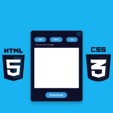
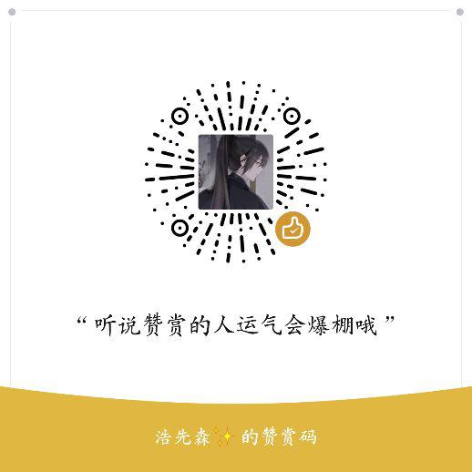

我不是什么大牛，我其实想做的就是一个传播者。内容可能过于基础，但对于刚入门的人来说或许是一个窗口，一个解惑之窗。我要先坚持分享20年，大家来一起见证吧。

每年至少会分享不少于`200篇`的优质文章，如果想第一时间获取文章，大家可以去[【公众号】](#公众号)获取或者加我[【微信】](#公众号)提意见(别忘记**Star**哟)。

  
  
  
  
  
  
 

​    

### 《100个最常问的JavaScript面试问答专栏》

100个最常问的JavaScript面试问答-第1部分:https://juejin.cn/post/6955458456149049357

100个最常问的JavaScript面试问答-第2部分:https://juejin.cn/post/6955458776916819999

100个最常问的JavaScript面试问答-第3部分:https://juejin.cn/post/6955458784722419749

100个最常问的JavaScript面试问答-第4部分:https://juejin.cn/post/6955458822592954381

# 目录(善用Ctrl+F)

-   [Web前端基础](https://blog.csdn.net/qq_44273429/category_10232485.html)
  - [Web前端基础（01）](https://juejin.cn/post/6955456083536298015)
  - [Web前端基础（02）](https://juejin.cn/post/6955456163882369061)
  - [Web前端基础（03）](https://juejin.cn/post/6955456171633459214)
  - [Web前端基础（04）](https://juejin.cn/post/6955456178012815397)
  - [Web前端基础（05）](https://juejin.cn/post/6955456184153276447)
  - [Web前端基础（06）](https://juejin.cn/post/6955456192386695205)
  - [Web前端基础（07）](https://juejin.cn/post/6955456197847695367)
  - [Web前端基础（08）](https://juejin.cn/post/6955456204692783112)
  - [Web前端基础（09）](https://juejin.cn/post/6955456210875351070)
-   [微信小程序](https://blog.csdn.net/qq_44273429/category_10300327.html)
  - [微信小程序从入门到入土教程(01)](https://juejin.cn/post/6964280083045416991/)
  - [微信小程序从入门到入土教程(02)](https://juejin.cn/post/6965734312943550478)
  - [微信小程序从入门到入土教程(03)](https://juejin.cn/post/6966057212447817735/)
  - [微信小程序从入门到入土教程(04)](https://blog.csdn.net/qq_44273429/article/details/108229591)
  - [微信小程序从入门到入土教程(05)](https://blog.csdn.net/qq_44273429/article/details/108310734)

- 面试
  - [程序员：如何写出杀手级简历？](https://mp.weixin.qq.com/s/0sXByP1U9HdxEvqS3OkSFg)
  - [35 道咱们必须要清楚的 React 面试题](https://mp.weixin.qq.com/s?__biz=MzI0NDQ0ODU3MA==&mid=2247485654&idx=1&sn=d45645ae678a199d6daf4a85c94f3948&chksm=e95ce483de2b6d9573eb5dbf6a7c5df3a96635148f0194e185b39a2ee156fec3815fd6f71233&token=450925916&lang=zh_CN#rd)
  - [常见的三个 JS 面试题](https://mp.weixin.qq.com/s?__biz=MzI0NDQ0ODU3MA==&mid=2247485358&idx=1&sn=50d0034e6a70e799dcef1299150bf94d&chksm=e95cebfbde2b62edf11a16f8ea04800b426d9320ec3f41fe479c4a9d3df6cf3a6b0adf809a3d&token=450925916&lang=zh_CN#rd)
  - [36 个JS 面试题为你助力金九银十(面试必读)](https://mp.weixin.qq.com/s?__biz=MzI0NDQ0ODU3MA==&mid=2247485239&idx=1&sn=76b460bff92be9f9fecd9148efcee236&chksm=e95ceb62de2b6274b2f9482e3a73e9812d4f64d74f6b0ea9e3cb27a2c42045afa1884e0d746c&token=450925916&lang=zh_CN#rd)
  - [50 个JS 必须懂的面试题为你助力金九银十](https://mp.weixin.qq.com/s?__biz=MzI0NDQ0ODU3MA==&mid=2247485195&idx=1&sn=84d366d468a8aa11dd0670b872af1c70&chksm=e95ceb5ede2b624815b2c3bcd01529644d5c07a8b745a0e441aec5af316e84df57b7244186d7&token=450925916&lang=zh_CN#rd)
  - [看完这几道 JavaScript 面试题，让你与考官对答如流（下）](https://mp.weixin.qq.com/s?__biz=MzI0NDQ0ODU3MA==&mid=2247486159&idx=1&sn=34440d8c4595efdaa2e70af4263e604e&chksm=e95ce69ade2b6f8cfd0aa0f587586553e938be872c38da0acaa2ecec365b4ebde862e1d69e60&token=450925916&lang=zh_CN#rd)
  - [看完这几道 JavaScript 面试题，让你与考官对答如流（中）](https://mp.weixin.qq.com/s?__biz=MzI0NDQ0ODU3MA==&mid=2247486155&idx=1&sn=43bd92968875847fd48fae4366366e87&chksm=e95ce69ede2b6f88c01aa8c3aafe92d7b72698503bdf03215eb622b6d221a795e38b175c37dc&token=450925916&lang=zh_CN#rd)
  - [看完这几道 JavaScript 面试题，让你与考官对答如流（上）](https://mp.weixin.qq.com/s?__biz=MzI0NDQ0ODU3MA==&mid=2247486147&idx=2&sn=263cb09017fee16a7336753e6167ade4&chksm=e95ce696de2b6f8047ae8f8428c07a7c307b98e2b04f4879d614c2c1d7d127baa0d5d87ad594&token=450925916&lang=zh_CN#rd)
  
  
  - [Vue 3 生命周期完整指南](https://mp.weixin.qq.com/s/ghLAYuC_zYi1ssrfOjKMRg)
  - [Vue3 Teleport 简介，请过目，这个是真的好用！](https://mp.weixin.qq.com/s/xlytZhw-NGyWwAZiajqU6g)
  - [尤雨溪：Vue 3 计划放弃支持 IE11](https://mp.weixin.qq.com/s/IYUXuS6KSnz9YCtddqiEFg)
  - [我问导师，Vue3有没有对应工具来生成漂亮的文档？ 用 Vitepress](https://mp.weixin.qq.com/s/HWydUHElZLDoeHLjqeR1jA)
  - [推荐 7 个 Vue2、Vue3 源码解密分析的开源项目](https://mp.weixin.qq.com/s/iUP5MV3ZsEFog6_egWTwTQ)
  - [何时何地使用 Vue 的作用域插槽](https://mp.weixin.qq.com/s/xTWYxK0bzCwNbLIWtb-cOg)
  - [用了很多动效，介绍 4个很 Nice 的 Veu 路由过渡动效！](https://mp.weixin.qq.com/s/T7zEMTGIJoP6tihhsDHeTw)
  - [2021，排名前 15 的 Vue 后台管理模板](https://mp.weixin.qq.com/s/4RVwmY8lOi4EmjR3iAW2nw)
  - [总结一下，Vue3 与 Vue2 的Props、全局组件的异同点！](https://mp.weixin.qq.com/s/9Lx-3uHGXtEgKuQX0rvjow)
  - [关于 Vue3 这些知识，你可能还不知道!](https://mp.weixin.qq.com/s/n045c6Oa0ulpYd9vva5o0A)
  - [一文让你30分钟快速掌握Vue3](https://mp.weixin.qq.com/s/1orWGlOXT2Wn2pJLK6VAIg)
  - [Vue3 Compiler 优化细节，如何手写高性能渲染函数](https://mp.weixin.qq.com/s/vhwWl4T5xuI-0_r_X4lMBQ)
  - [深入理解 Vue3 Reactivity API](https://mp.weixin.qq.com/s/CYTSFsXkOevpZb38psvxZQ)
  - [Vue3 Compiler 优化细节，如何手写高性能渲染函数](https://mp.weixin.qq.com/s/vhwWl4T5xuI-0_r_X4lMBQ)
  - [不要再用Vue 2的思维写Vue 3了](https://mp.weixin.qq.com/s/W_2Yb7QkcgOdewVqtaEQQQ)
  
  
  

# 赞赏码

熬夜不易，觉得有很大帮助的朋友可以赏杯咖啡(**不接受学生赞赏**)，赏了一定要加我微信跟我说。

 

# 鸣谢

****

​                                                             

  

加我个人微信回复 **"加群"** 或者关注公众号，并进入公众号 **[进群交流]** ，添加好友即可。 公众号也会经常分享一些干货。

微信搜索 **[啦啦啦好想biu点什么]** ，第一时间阅读或者扫描下方的二维码。

